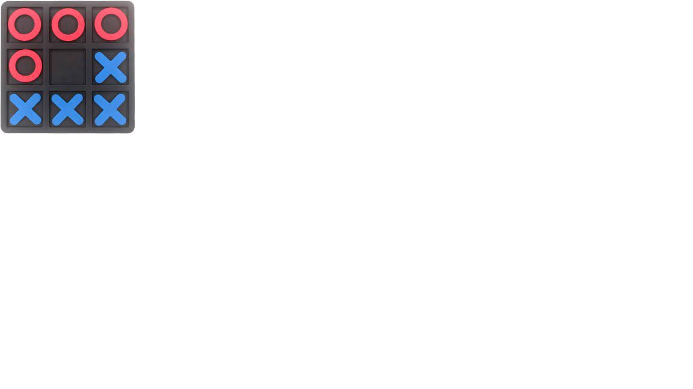

## Mod1-TicTacToe

# Tic Tac Toe
### Tech Stack:
This tac toe project was created with:
* HTML 
* CSS 
* Javascript. 

### Basic Information
This game features two players X and O, striving to win on the same board by getting three patterns of their characters horizontally, vertically, diagonally, and anti-diagonally. 
Depending on the winner the user is allowed restart the game and continue playing.

### Challenges:
Some of the main concepts took a while to understand. I had to take a few tutorials on YouTube to get a fair template of how to build the game. 
In all fairness it was quite a big deal of information. 
However with the challenge came the rewards of the understanding the concepts learned in class a lot more better.

### Future Improvements:
I would like to add the functionality of any user to play with an AI. 
This I believe would greatly stretch the user and make it a bit more interesting. 
(If the user can beat AI, they would certainly feel a lot smarter). 
I would also like to add scores for tracking that way the user can actually know their progress.
